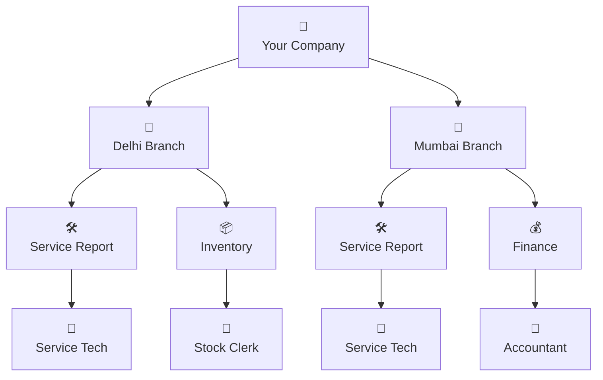

# Busiman Overview

## 🎯 **What is Busiman?**

Busiman is a **free, complete business management system** designed for Indian businesses. Manage your inventory, branches, teams, and operations - all in one place.

## 🏢 **How Your Business Works in Busiman**

Busiman organizes your business like a real company structure. Your main company can have multiple branches (like Delhi, Agra, Mumbai), and each branch can have different departments (Sales, Inventory, Production, etc.). Within each department, you have team members with different roles.

**Example Structure:**

- **Company Level**: Overall business settings and executive decisions
- **Branch Level**: Location-specific operations and management
- **Department Level**: Specialized functions like sales, inventory, or production
- **Team Level**: Individual employees with specific roles and permissions

This flexible structure lets you mirror your real business exactly, whether you have 1 branch or 100 branches. Each branch can have different departments and team members based on their specific needs.

## 👥 **Team Roles & Permissions**

| **Permission**           | **👷 Worker** | **👔 Manager**  | **🏆 Executive** |
| ------------------------ | ------------- | --------------- | ---------------- |
| **Daily Tasks**          | ✅            | ✅              | ✅               |
| **Inventory Management** | ✅            | ✅              | ✅               |
| **View Reports**         | ❌            | ✅ (Department) | ✅ (All)         |
| **Manage Team**          | ❌            | ✅ (Workers)    | ✅ (All Users)   |
| **Approve Transactions** | ❌            | ✅ (Limited)    | ✅ (Unlimited)   |
| **Company Settings**     | ❌            | ❌              | ✅               |
| **Financial Reports**    | ❌            | ❌              | ✅               |

## 📊 **Business Features**

| Feature                    | Description                                                                        |
| -------------------------- | ---------------------------------------------------------------------------------- |
| **🏪 Multi-Branch**        | Unlimited branches, inter-branch transfers, location-specific analytics            |
| **📦 Smart Inventory**     | Real-time stock tracking, low-stock alerts, barcode scanning, expiry management    |
| **👥 Team Management**     | Unlimited users, role-based permissions, performance tracking, secure access       |
| **💰 Payments & Billing**  | UPI/cards/cash payments, auto-invoicing, transaction history, Razorpay integration |
| **🏭 Manufacturing**       | BOM management, production planning, raw material tracking, quality control        |
| **📋 Service Management**  | Service requests, technician assignments, customer feedback, SLA monitoring        |
| **📞 Customer Database**   | Contact management, interaction history, relationship tracking, communication logs |
| **📈 Reports & Analytics** | Real-time dashboards, custom reports, financial summaries, PDF/Excel export        |

## 🚀 **Get Started in Minutes**

1. **Sign up** at [busiman.in](https://busiman.in)
2. **Add your company** details
3. **Set up branches** and departments
4. **Invite your team** with appropriate roles
5. **Import inventory** and contacts
6. **Start managing** your business!

### **No Setup Required**

- Completely free
- No setup fees
- No credit card required
- 24/7 support included

## 💡 **Why Teams Love Busiman**

- **⚡ Real-time updates** - See changes instantly
- **🔒 Enterprise security** - SOC 2 compliant
- **🕒 24/7 support** - Help in Hindi and English
- **📊 Smart insights** - Make better decisions
- **🎯 Simple to use** - No training required
