# Inventory Overview

Welcome to Busiman's comprehensive inventory management system. Track your products, manage warehouses, and control stock movements across your entire business with precision and ease.

## 🎯 **What is Inventory Management?**

Inventory management in Busiman is your complete solution for tracking products, managing stock levels, and controlling inventory movements across multiple warehouses and stores. Whether you have one warehouse or fifty, Busiman scales with your business needs.

## 🏭 **How Inventory Works in Busiman**

Busiman organizes your inventory in a hierarchical structure that mirrors real-world warehouse operations:

```mermaid
flowchart TD
    A[🏭<br/>Warehouse] --> B[🏪<br/>Store A]
    A --> C[🏪<br/>Store B]

    B --> D[📦<br/>Product 1]
    B --> E[📦<br/>Product 2]
    B --> F[📁<br/>Group 1]

    C --> G[📁<br/>Group 2]
    C --> N[📦<br/>Product F]
    C --> O[📦<br/>Product G]

    F --> I[📦<br/>Product A]
    F --> J[📦<br/>Product B]
    F --> K[📦<br/>Product C]

    G --> L[📦<br/>Product D]
    G --> M[📦<br/>Product E]

    class A warehouse
    class B,C store
    class D,E,I,J,K,L,M,N,O product
    class F,G group
```

**Key Concepts:**

- **🏭 Warehouse**: Your physical storage locations (Delhi Warehouse, Mumbai Warehouse)
- **🏪 Store**: Sub-sections within warehouses for better organization (Reserve Store, Main Store)
- **📦 Products**: Individual items you sell or use (Product 1, Product 2, Product A, etc.)
- **📁 Groups**: Categories to organize related products (Group 1, Group 2, Group 3)

## 📊 **Inventory Features Overview**

| Feature                      | Description                                          | Access Level |
| ---------------------------- | ---------------------------------------------------- | ------------ |
| **🏭 Warehouse Management**  | Create and manage multiple warehouses                | Managers+    |
| **🏪 Stores Management**     | Organize inventory within warehouses                 | Managers+    |
| **📦 Product Inventory**     | Add products and track stock levels                  | All Users    |
| **📁 Groups & Organization** | Categorize products for better management            | All Users    |
| **🔄 Stock Transfers**       | Check-in, check-out, replace, and internal transfers | All Users    |
| **📋 Requests & Approvals**  | Request system for inventory movements               | All Users    |
| **⚙️ Inventory Settings**    | Configure preferences and automation                 | Managers+    |

## 🔄 **Inventory Workflow**

### Daily Operations Flow

### Typical Business Day

1. **Morning**: Check stock levels and review pending requests
2. **Throughout Day**: Process check-ins (receiving new stock) and check-outs (issuing stock)
3. **As Needed**: Handle replacements for defective items or internal transfers
4. **Evening**: Review daily transactions and prepare for next day

## 🚀 **Getting Started with Inventory**

### Prerequisites

- Complete [company and branch setup](/getting-started/onboarding)
- Set up your [product catalog](/getting-started/quick-start#-step-1-set-up-your-product-catalog)

### First Steps

1. **Create your first warehouse** - Set up your primary storage location
2. **Configure stores** (optional) - Organize your warehouse into sections
3. **Add products** - Start tracking your inventory items
4. **Set up groups** - Organize products into categories
5. **Process your first transfer** - Learn check-in and check-out operations

### Quick Setup Checklist

- [ ] Warehouse created
- [ ] Stores configured (if needed)
- [ ] Products added
- [ ] Groups organized
- [ ] First stock transfer completed

## 💡 **Pro Tips**

- **🏭 Start Simple**: Begin with one warehouse, then expand as your business grows
- **🏪 Use Stores Wisely**: Only enable stores if you need detailed sub-organization
- **📦 Product First**: Always add products to your catalog before managing inventory
- **📁 Group Strategically**: Use groups to match your business categories and reporting needs
- **🔄 Regular Transfers**: Process transfers immediately to keep records accurate
- **📊 Monitor Alerts**: Set up minimum stock levels to avoid stockouts
- **📋 Request System**: Use requests for better control over inventory movements
- **📱 Serial Numbers**: Enable for high-value items that need individual tracking
- **🏷️ Categories**: Use consistent categories for better organization and reporting
- **🔍 Search Power**: Master filters to quickly find products across warehouses

:::info Need Help?
Our support team is available **24/7** in Hindi and English. Contact us if you need assistance setting up your inventory system.
:::
