# Requests & Approvals

Manage inventory requests, approval workflows, and transaction tracking across your warehouses. Learn how to handle pending requests, approve cross-warehouse transfers, and maintain proper inventory control through structured request management.

## 📋 **What are Requests & Approvals?**

The Requests & Approvals system in Busiman provides structured control over inventory movements, ensuring that all stock transfers require proper authorization and tracking. This system prevents unauthorized inventory changes and maintains audit trails for all transactions.

```mermaid
flowchart TD
    A[📋 Request Created] --> B{Request Type?}
    B --> C[🏪 Internal Transfer]
    B --> D[🏭 Cross-Warehouse]
    B --> E[📤 Check-Out]

    C --> F[Auto Approved]
    D --> G[Pending Approval]
    E --> H[Manager Approval]

    G --> I[✅ Accept]
    G --> J[❌ Reject]

    I --> K[Stock Moved]
    J --> L[Request Cancelled]
```

## 📋 **Cross-Warehouse Requests**

The Requests & Approvals system primarily handles **cross-warehouse transfers** - the only transfer type that requires approval before stock movement occurs. As shown in the diagram above, internal store transfers and check-out requests are processed immediately without creating approval requests.

### **Cross-Warehouse Transfer Process**

**Approval Required**: When products need to move between different warehouses, the receiving warehouse must approve the transfer before stock is actually moved.

- **Sending Warehouse**: Initiates the transfer request
- **Receiving Warehouse**: Reviews and approves/rejects the request
- **Approval Workflow**: Manager-level review required before stock movement
- **Reserve Store**: Approved products are automatically allocated to Reserve Store
- **Rejection**: If rejected, stock remains in the sending warehouse

## 📊 **Managing Requests**

### Viewing Requests

Access request management through your warehouse dashboard:

1. **Navigate**: Dashboard → Inventory → Warehouse → Requests
2. **Filter Options**:
   - **By Request**: View requests grouped by request ID
   - **By Product**: View individual products across requests
3. **Status Filters**: Pending, Approved, Rejected, Completed

### Advanced Search & Filtering

Use comprehensive search filters to find specific requests:

- **Product Name**: Search by product name or aliases
- **Serial Numbers**: Find requests containing specific serial numbers
- **Request Type**: Filter by cross-warehouse or check-out types
- **Customer Name**: Search by customer for check-out requests
- **Receiver Name**: Filter by receiving party
- **Store Filters**: From Store and To Store locations
- **Requested By**: Filter by the user who created the request
- **Bill Number**: Search by associated bill/challan numbers

### Request Status Indicators

Visual cues help identify request types at a glance:

- **Green Rows**: Check-in requests (products entering warehouse)
- **Red Rows**: Check-out requests (products leaving warehouse)
- **Status Colors**: Color-coded status badges (Pending, Approved, Rejected)

### Request Details

Each cross-warehouse request displays comprehensive information:

- **Request ID**: Unique identifier for tracking
- **Date Created**: When the request was submitted
- **Status**: Current approval status (Pending, Approved, Rejected)
- **Products**: Detailed list with quantities and serial numbers
- **Requester**: User who created the request
- **Warehouses**: Sending and receiving warehouse information

## 📋 **Detailed Request View**

### Opening Request Details

Click "Open Request Details" from any request row to view the complete transfer information:

- **Cross-Warehouse Requests**: Navigate to detailed transfer view
- **Request Information**: Complete sender/receiver details
- **Product Breakdown**: Individual product quantities and serial numbers
- **Approval Actions**: Accept or reject options for authorized users

### Request Header Information

The detailed view displays:

- **Transfer Number**: Unique request identifier
- **Status Badge**: Color-coded approval status
- **Sender Details**: Sending warehouse and contact information
- **Receiver Details**: Receiving warehouse and contact information
- **Transaction Type**: Cross-warehouse transfer indicator
- **Reference ID**: Service report number for tracking

### Product Details Table

View comprehensive product information:

- **Product Name**: Item name with aliases
- **Dispatched From**: Source store location
- **Quantity**: Total quantity being transferred
- **Serial Numbers**: Individual item tracking numbers
- **Additional Fields**: Custom serial number metadata
- **Allocation Store**: Destination store selection (for receivers)

### Serial Number Management

Handle complex serial number tracking:

- **Primary Serial Numbers**: Main tracking identifiers
- **Additional Metadata**: Custom fields for serial numbers (condition, warranty, etc.)
- **Batch Processing**: Handle multiple serial numbers per product
- **Validation**: Ensure serial number uniqueness and format compliance
- **Conflict Resolution**: Manage duplicate serial number scenarios

### Store Allocation (Receiver View)

When approving requests, receivers can specify where products should be stored:

- **Store Selection**: Choose from available stores in receiving warehouse
- **Reserve Store Default**: Automatic allocation to Reserve Store
- **Custom Allocation**: Select specific stores for different products
- **Bulk Assignment**: Apply store selections to multiple products

### Bill Date Management

Set transaction dates for approved transfers:

- **Bill Date Picker**: Select appropriate transaction date
- **Automatic Defaults**: System suggests current date
- **Historical Dating**: Back-date transactions when needed
- **Compliance Tracking**: Maintain accurate transaction timelines

## ✅ **Accepting Requests**

### Cross-Warehouse Transfer Approval

When a cross-warehouse request is received:

1. **Review Request**: Check product details, quantities, and serial numbers
2. **Verify Availability**: Ensure receiving warehouse can accommodate the transfer
3. **Accept Request**: Approve to move stock to Reserve Store
4. **Automatic Allocation**: Products are automatically added to Reserve Store

### Check-Out Request Approval

For customer sales and external issuances:

1. **Verify Customer**: Confirm customer details and requirements
2. **Check Stock**: Ensure sufficient inventory for the sale
3. **Review Documentation**: Verify bill/challan information
4. **Approve**: Process the check-out transaction

## ❌ **Rejecting Requests**

### Rejection Process

Requests can be rejected for various reasons:

- **Insufficient Stock**: Not enough inventory available
- **Invalid Request**: Incorrect product or quantity information
- **Policy Violation**: Request doesn't meet company policies
- **Warehouse Constraints**: Receiving warehouse cannot accommodate

### Reserve Store Confirmation

When accepting cross-warehouse requests, a confirmation dialog appears:

- **Automatic Allocation**: Products are added to Reserve Store by default
- **Confirmation Required**: User must confirm the allocation
- **Bulk Processing**: All products in the request are processed together
- **Cancellation Option**: Can cancel if Reserve Store allocation is not desired

## 🔐 **Permissions & Access Control**

### Permission Levels

| Role        | View Requests | Create Requests | Approve Requests | Reject Requests |
| ----------- | ------------- | --------------- | ---------------- | --------------- |
| **Worker**  | ✅            | ✅              | ❌               | ❌              |
| **Manager** | ✅            | ✅              | ✅               | ✅              |
| **Admin**   | ✅            | ✅              | ✅               | ✅              |

### Warehouse-Specific Access

- **Warehouse Managers**: Can approve requests for their warehouse
- **Cross-Warehouse**: Only receiving warehouse can approve transfers
- **Check-Out**: Requires manager-level approval for external sales

## 🛠️ **Troubleshooting**

### Common Issues

#### Cross-Warehouse Transfer Not Appearing

**Problem**: New cross-warehouse request not visible in receiving warehouse

**Solution**:

- Check if request was properly submitted
- Verify receiving warehouse selection
- Refresh the requests page
- Contact system administrator if issue persists

#### Cannot Accept Request

**Problem**: Accept button disabled or permission denied

**Solution**:

- Verify you have manager permissions for the receiving warehouse
- Check if you're accessing the correct warehouse dashboard
- Ensure request status is still "Pending"

#### Reserve Store Not Available

**Problem**: Cannot allocate products to Reserve Store during approval

**Solution**:

- Verify Reserve Store exists in the receiving warehouse
- Check store configuration and permissions
- Contact administrator to create/configure Reserve Store

#### Serial Number Conflicts

**Problem**: Serial numbers already exist in receiving warehouse

**Solution**:

- Review serial number details in the request
- Coordinate with sending warehouse to resolve conflicts
- Reject request with explanation if duplicates cannot be resolved

#### Store Allocation Required

**Problem**: Cannot accept request without selecting allocation stores

**Solution**:

- Ensure all products have store selections in receiver view
- Check that selected stores exist and are accessible
- Verify you have permissions to allocate to selected stores
- Contact administrator if store access issues persist

#### Bill Date Issues

**Problem**: Unable to set or modify bill dates for approved requests

**Solution**:

- Bill date picker only available for pending requests
- Once approved, bill dates cannot be modified
- Set correct date before approving the request
- Contact administrator for date corrections on approved requests

### Request Status Issues

#### Stuck in Pending Status

**Problem**: Request remains pending longer than expected

**Solution**:

- Check approval workflow for the request type
- Verify appropriate managers are notified
- Contact relevant personnel to review the request

#### Incorrect Request Type

**Problem**: Request created with wrong type (internal vs cross-warehouse)

**Solution**:

- Cannot change request type after creation
- Cancel incorrect request and create new one
- Use correct warehouse/store selection during creation

## 💡 **Best Practices**

### Request Management

- **Review Daily**: Check pending requests at the start of each day
- **Prompt Decisions**: Approve or reject requests within 24 hours
- **Clear Communication**: Provide reasons when rejecting requests
- **Documentation**: Maintain proper bill/challan records for check-outs

### Approval Workflow

- **Verify Details**: Always check product quantities and serial numbers
- **Stock Availability**: Confirm sufficient space in receiving locations
- **Policy Compliance**: Ensure requests meet company inventory policies
- **Audit Trail**: Maintain complete records for compliance

### Cross-Warehouse Coordination

- **Communication**: Coordinate with sending warehouse for large transfers
- **Planning**: Schedule transfers during appropriate business hours
- **Documentation**: Keep records of all cross-warehouse movements
- **Reserve Store**: Use Reserve Store for temporary holding of approved transfers

:::info Need Help?
Our support team is available **24/7** in Hindi and English. Contact us for assistance with product setup, inventory optimization, or complex multi-location management.
:::
